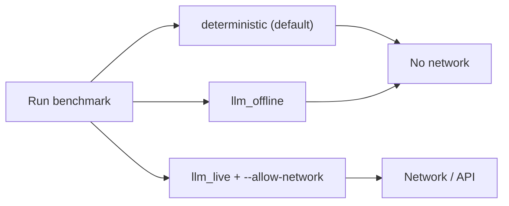

# LabTrust-Gym

<p align="center">
  
</p>

[](https://opensource.org/licenses/Apache-2.0)
[](https://www.python.org/downloads/)

**A multi-agent environment (PettingZoo/Gym) for hospital lab automation, with a reference trust skeleton.**

---

## Contents

- [LabTrust-Gym](#labtrust-gym)
  - [Contents](#contents)
  - [North star](#north-star)
  - [Who is this for? / I want to...](#who-is-this-for--i-want-to)
  - [Installation (pip)](#installation-pip)
  - [Pipelines](#pipelines)
  - [Quick eval](#quick-eval)
  - [CLI](#cli)
    - [Policy and validation](#policy-and-validation)
    - [Benchmarking and evaluation](#benchmarking-and-evaluation)
    - [Export and verification](#export-and-verification)
    - [Security and safety](#security-and-safety)
    - [Risk register](#risk-register)
    - [Coordination and studies](#coordination-and-studies)
    - [Release and reproducibility](#release-and-reproducibility)
  - [Repository structure](#repository-structure)
  - [Reproducibility and citation](#reproducibility-and-citation)
  - [License](#license)

---

## North star

| Pillar | Goal |
|--------|------|
| **Environment** | Pip-installable, standard multi-agent API (PettingZoo AEC or parallel). |
| **Trust skeleton** | Roles/permissions, signed actions, hash-chained audit log, invariants, reason codes. |
| **Benchmarks** | Tasks (throughput_sla, adversarial_disruption, insider_key_misuse, coord_scale, coord_risk) and baselines (scripted, MARL, LLM). The **golden suite** defines correctness; regression means passing the suite. Safety/throughput trade-offs are measurable. |
| **Coordination** | Pluggable coordination methods; **coord_scale** (scale stress) and **coord_risk** (under injection). Method–risk matrix and coordination security pack with gate thresholds; SOTA and method-class comparison. |
| **Security & safety** | **Security attack suite** (prompt injection, tool, memory, detector, coordination-under-attack); **risk register** bundle with evidence and gaps; **coverage gate** (required_bench); **safety case**. Evidence bundles and verify-release chain for auditability. |

**Principles**

- **Golden scenarios drive development** — Correctness is defined as passing the golden suite; the suite is the specification for regression. It does not cover all failure modes; gaps imply gaps in assured behavior.
- **Policy is data** — Invariants, tokens, reason codes, catalogue, zones live in versioned files under `policy/`.
- **No silent failure** — Missing hooks or invalid data fail loudly with reason codes.
- **Evidence over claims** — Security and safety are evidenced by the attack suite, coordination security pack, and risk register; required_bench cells must be covered or explicitly waived.

System and threat model: [Systems and threat model](docs/architecture/systems_and_threat_model.md).

> **Limitation** — Passing all sim tests and gates does **not** imply production safety. Production adds distribution shift, real adversaries, key/ops failures, and environment drift. Use sim for development and regression; production assurance is the integrator's responsibility.

---

## Who is this for? / I want to...

| I want to... | First step |
|--------------|------------|
| Run benchmarks only | `pip install labtrust-gym[env,plots]` then `labtrust quick-eval` |
| Add my coordination method (or task) | [Extension development](docs/agents/extension_development.md) + entry_points; see [examples/extension_example](https://github.com/fraware/LabTrust-Gym/tree/main/examples/extension_example) |
| Fork and customize policy | [Forker guide](docs/getting-started/forkers.md) and `labtrust forker-quickstart` |
| Use as a library without forking | [Extension development](docs/agents/extension_development.md) + `--profile` + `extension_packages` in a lab profile |
| Run the full security suite | `labtrust run-security-suite`; needs `.[env]`; use `--skip-system-level` when env is not installed |

Stable surface for extensions: [Public API](docs/reference/public_api.md).

---

## Installation (pip)

**From PyPI** (env + plots for benchmarks and quick-eval)

```bash
pip install labtrust-gym[env,plots]
labtrust --version
labtrust quick-eval
```

Runs one episode each of `throughput_sla`, `adversarial_disruption`, and `multi_site_stat` with scripted baselines; summary and logs under `./labtrust_runs/`.

**From source** (development)

```bash
git clone https://github.com/fraware/LabTrust-Gym.git
cd LabTrust-Gym
pip install -e ".[dev]"
labtrust validate-policy
pytest -q
```

**Full stack** (benchmarks, studies, plots)

```bash
pip install -e ".[dev,env,plots]"
labtrust run-benchmark --task throughput_sla --episodes 5 --out results.json
labtrust reproduce --profile minimal
```

**New to the repo?** [Forker guide](docs/getting-started/forkers.md) and [Quick demos](docs/getting-started/quick_demos.md) for customizing and running commands end-to-end.

**Extending without forking**

- **Option A** — Fork and customize via partner overlay and policy. [Forker guide](docs/getting-started/forkers.md).
- **Option B** — Install `labtrust-gym` and ship your own pip package (domains, tasks, coordination methods, etc. via `register_*` or entry_points; `--profile` and `extension_packages`). [Extension development – Option B](docs/agents/extension_development.md#integration-pattern-option-b).

**Optional extras**

| Extra | Purpose |
|-------|---------|
| `[env]` | PettingZoo/Gymnasium (benchmarks and full security suite including coord_pack_ref) |
| `[plots]` | Matplotlib and Pillow (study figures, data tables) |
| `[llm_openai]` | OpenAI live backend (openai_live) |
| `[llm_anthropic]` | Anthropic live backend (anthropic_live) |
| `[marl]` | Stable-Baselines3 (PPO train/eval) |
| `[marl_hpo]` | Optuna (HPO for PPO) |
| `[docs]` | MkDocs + mkdocstrings |

Full security suite (including coord_pack_ref) requires `[env]`; use `--skip-system-level` when env is not installed.

---

## Pipelines

Benchmarks run in one of three modes: **deterministic** | **llm_offline** | **llm_live** ([Live LLM](docs/agents/llm_live.md)). **Defaults are offline** (no network, no API cost).



| Mode | Network | Agents | Use case |
|------|---------|--------|----------|
| **deterministic** | No | Scripted only | CI, regression, reproduce, paper artifact (default) |
| **llm_offline** | No | LLM interface, deterministic backend only | Offline LLM evaluation, no API calls |
| **llm_live** | Yes (opt-in) | Live OpenAI/Ollama | Interactive or cost-accepting runs; requires `--allow-network` |

Set mode with `--pipeline-mode`; for live LLM add `--allow-network` or `LABTRUST_ALLOW_NETWORK=1`.

---

## Quick eval

```bash
labtrust quick-eval
```

Output: markdown summary (throughput, violations, blocked counts) and logs under `./labtrust_runs/quick_eval_<timestamp>/`. Use `--seed` and `--out-dir` to customize.

**Canonical demos:** `labtrust forker-quickstart`, `labtrust quick-eval`, `labtrust run-summary --run <dir>`, `labtrust run-official-pack` (add `--include-coordination-pack` for coordination and security evidence). [Quick demos](docs/getting-started/quick_demos.md) lists "if you want to see X, run Y."

**Example agents:** [Example experiments](docs/getting-started/example_experiments.md); agents and configs in `examples/`. Optional notebook `examples/quick_eval.ipynb` (requires `.[env,plots]`). External agent:

```bash
labtrust eval-agent --agent 'examples.external_agent_demo:SafeNoOpAgent' --task throughput_sla --episodes 2 --out out.json
```

---

## CLI

Put CLI outputs in `labtrust_runs/` or `--out`. Exit codes, minimal smoke args, and output paths: [CLI output contract](docs/contracts/cli_contract.md). Commands are smoke-tested in `tests/test_cli_smoke_matrix.py`.

### Policy and validation

| Command | Description |
|---------|-------------|
| **validate-policy** | Validate policy YAML/JSON. `--domain <domain_id>` merges base + `policy/domains/<domain_id>/`; `--partner <id>` for overlay. |
| **forker-quickstart** | One-command forker: validate-policy, coordination pack, lab report, risk register export. [Forker guide](docs/getting-started/forkers.md). |

### Benchmarking and evaluation

| Command | Description |
|---------|-------------|
| **quick-eval** | One episode each of throughput_sla, adversarial_disruption, multi_site_stat; summary + logs under `./labtrust_runs/`. |
| **run-benchmark** | Run tasks (throughput_sla, stat_insertion, qc_cascade, adversarial_disruption, multi_site_stat, insider_key_misuse, coord_scale, coord_risk). Requires `--task`, `--out`. Options: `--episodes`, `--seed`, `--coord-method`, `--injection`, `--scale`, `--timing`, `--llm-backend`, `--llm-agents`, `--always-step-timing`, `--approval-hook`. Agent-centric: `--agent-driven`, `--multi-agentic`; optional `--use-parallel-multi-agentic`. [Live LLM](docs/agents/llm_live.md), [Scale limits](docs/benchmarks/scale_operational_limits.md). |
| **run-summary** | One-line stats for a run dir. `--run <dir>`, `--format json`. |
| **eval-agent** | Benchmark with external agent (e.g. `examples.external_agent_demo:SafeNoOpAgent` or PPO via `LABTRUST_PPO_MODEL` and `labtrust_gym.baselines.marl.ppo_agent:PPOAgent`). |
| **bench-smoke** | One episode per task (throughput_sla, stat_insertion, qc_cascade). |
| **determinism-report** | Run twice; assert v0.2 metrics and episode log hash. Requires `--task`, `--episodes`, `--seed`, `--out`. |
| **train-ppo**, **eval-ppo** | PPO train/eval (`.[marl]`). Writes `train_config.json`. Optional HPO: `.[marl_hpo]`. [MARL baselines](docs/agents/marl_baselines.md). |

### Export and verification

| Command | Description |
|---------|-------------|
| **export-receipts** | Receipt.v0.1 and EvidenceBundle.v0.1 from episode log. |
| **export-fhir** | HL7 FHIR R4 Bundle from receipts (data-absent-reason, no placeholder IDs). [FHIR export](docs/export/fhir_export.md). |
| **validate-fhir** | Validate bundle codes: `--bundle <path> --terminology <value_set_json>` [--strict]. [FHIR export](docs/export/fhir_export.md). |
| **verify-bundle** | Verify one EvidenceBundle.v0.1. `--strict-fingerprints` for coordination, memory, rbac, tool_registry. |
| **verify-release** | Verify release: EvidenceBundles, risk register, RELEASE_MANIFEST hashes. `--strict-fingerprints` for releases. [Trust verification](docs/risk-and-security/trust_verification.md). |
| **build-release-manifest** | Write RELEASE_MANIFEST.v0.1.json into `--release-dir`. Run after export-risk-register; then verify-release. |
| **ui-export** | UI-ready zip (index, events, receipts_index, reason_codes). [UI data contract](docs/contracts/ui_data_contract.md). |

### Security and safety

| Command | Description |
|---------|-------------|
| **run-security-suite** | Smoke/full; SECURITY/attack_results.json. Options: `--agent-driven-mode single | multi_agentic`, `--use-full-driver-loop`, `--use-mock-env` (MockBenchmarkEnv). [Security attack suite](docs/risk-and-security/security_attack_suite.md). |
| **safety-case** | Generate SAFETY_CASE/. [Risk register](docs/risk-and-security/risk_register.md). |
| **run-official-pack** | Official pack (baselines, coordination, security, safety, transparency). `--out <dir>`, `--seed-base`, `--include-coordination-pack` for coordination_pack/ and lab report. [Official benchmark pack](docs/benchmarks/official_benchmark_pack.md). |

### Risk register

| Command | Description |
|---------|-------------|
| **export-risk-register** | RiskRegisterBundle.v0.1 to `--out`; `--runs` (repeatable) for evidence dirs. Gaps as first-class. [Risk register](docs/risk-and-security/risk_register.md). |
| **build-risk-register-bundle** | Same bundle to explicit path. |
| **validate-coverage** | Required_bench evidenced or waived. `--strict` to fail on missing. |

### Coordination and studies

| Command | Description |
|---------|-------------|
| **run-coordination-study** | Scale x method x injection; summary_coord.csv, pareto.md, SOTA leaderboard. [Coordination studies](docs/coordination/coordination_studies.md). |
| **run-coordination-security-pack** | Regression pack. `--out`, `--matrix-preset` (hospital_lab, hospital_lab_full, full_matrix, exploratory_*). pack_results/, pack_summary.csv, pack_gate.md. [Security attack suite](docs/risk-and-security/security_attack_suite.md#coordination-security-pack-internal-regression). |
| **summarize-coordination** | SOTA leaderboard, method-class comparison. |
| **recommend-coordination-method** | COORDINATION_DECISION.v0.1.json from run dir. |
| **build-coordination-matrix** | CoordinationMatrix v0.1 from llm_live run. |
| **run-study** | Study from spec (`--spec`, `--out`). |
| **make-plots** | Figures and data tables from study run. |

### Release and reproducibility

| Command | Description |
|---------|-------------|
| **reproduce** | Minimal/full results + figures (`--profile minimal | full`). [Reproduce](docs/benchmarks/reproduce.md). |
| **package-release** | Release artifact: receipts, FHIR, MANIFEST, BENCHMARK_CARD. `--profile paper_v0.1` for paper-ready. [Paper provenance](docs/benchmarks/paper/README.md). |
| **generate-official-baselines** | Core tasks with official baselines. Registry: `benchmarks/baseline_registry.v0.1.yaml`. |
| **summarize-results** | summary_v0.2.csv, summary_v0.3.csv, summary.md (bounded memory). [Metrics contract](docs/contracts/metrics_contract.md). |
| **serve** | HTTP server (auth, rate limits). [Security controls](docs/risk-and-security/security_online.md). |

---

## Repository structure

| Path | Description |
|------|-------------|
| **policy/** | YAML/JSON: schemas, emits, invariants, tokens, reason_codes, zones, catalogue, coordination, golden, official, llm, partners, **risks** (risk_registry, waivers, required_bench_plan.v0.1). `labtrust validate-policy`. |
| **src/labtrust_gym/** | Package: config, engine/, envs/, baselines/, benchmarks/, policy/, security/, studies/, export/, online/, runner/, cli/. |
| **tests/** | Pytest: golden suite, policy, benchmarks, coordination, risk_injections, studies, export, online, CLI smoke (`test_cli_smoke_matrix.py`). |
| **benchmarks/** | Baseline registry, official baselines (v0.1, v0.2). |
| **examples/** | Example agents (external_agent_demo, scripted_ops_agent, llm_agent_mock_demo, etc.). |
| **docs/** | MkDocs: architecture, benchmarks, coordination, contracts, getting started, security, LLM, MARL. [Forker guide](docs/getting-started/forkers.md). **docs/assets/** — repo logo (`logo.svg`). |
| **scripts/** | **run_hospital_lab_full_pipeline.py** (orchestrator; `--include-coordination-pack`, `--providers`), **check_llm_backends_live.py**, quickstart, run_required_bench_matrix, extract_paper_claims_snapshot, build_release_fixture, build_viewer_data_from_release, run_external_reviewer_checks. |
| **tests/fixtures/ui_fixtures/** | Minimal results, episode log, evidence bundle for offline UI. |

---

## Reproducibility and citation

Cite using [CITATION.cff](CITATION.cff).

| Action | Command / reference |
|--------|---------------------|
| **Reproduce** | `labtrust reproduce --profile minimal` — [Reproduce](docs/benchmarks/reproduce.md). |
| **Release artifact** | `labtrust package-release --profile minimal --out /tmp/labtrust_release`. Paper-ready: `--profile paper_v0.1` — [Paper provenance](docs/benchmarks/paper/README.md). |
| **Research and audit** | Paper-ready artifact + verify-release — [Quick demos](docs/getting-started/quick_demos.md), [Paper provenance](docs/benchmarks/paper/README.md). |
| **Standardized evaluation** | [Benchmark card](docs/benchmarks/benchmark_card.md), official baselines v0.2 — [Use cases and impact](docs/reference/use_cases_and_impact.md). |
| **Official baselines** | v0.2 in `benchmarks/baselines_official/v0.2/`. Regenerate: `labtrust generate-official-baselines --out benchmarks/baselines_official/v0.2/ --episodes 3 --seed 123 --force`. Compare: `labtrust summarize-results --in benchmarks/baselines_official/v0.2/results/ your_results.json --out /tmp/compare`. |
| **Cite** | [CITATION.cff](CITATION.cff) or *LabTrust-Gym: a multi-agent environment for hospital lab automation (pathology lab / blood sciences) with a trust skeleton*. https://github.com/fraware/LabTrust-Gym. |

---

## License

Apache-2.0.
