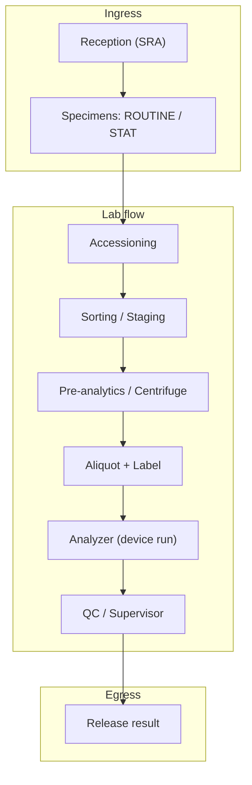
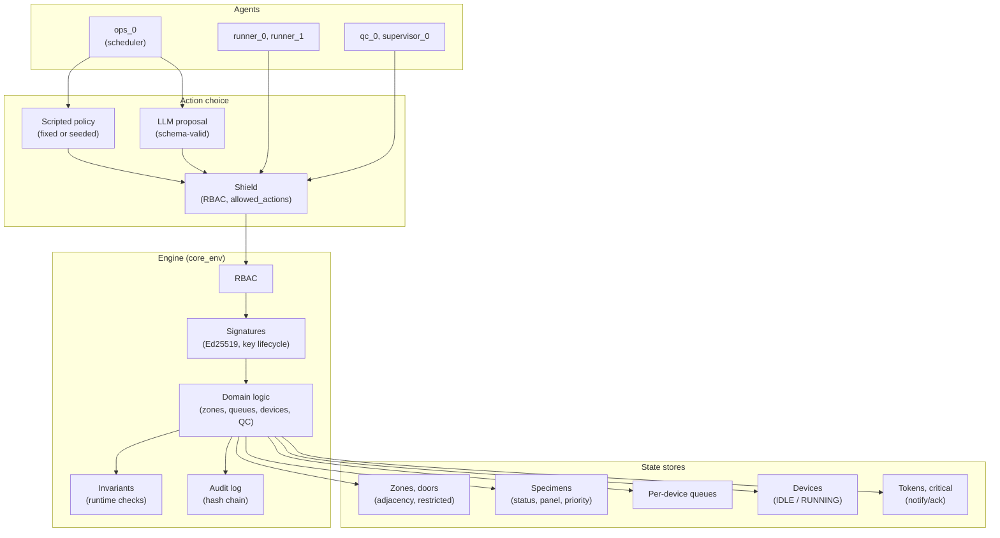
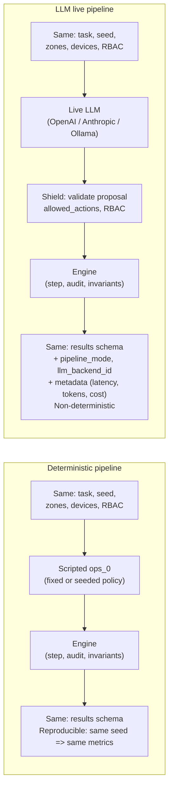

# Hospital lab workflow

This document gives two views of the hospital lab workflow modeled in LabTrust-Gym and how it differs under the **deterministic** and **LLM live** pipelines. Diagrams are Mermaid; they render on GitHub and in MkDocs with a Mermaid plugin. Otherwise paste the code into [Mermaid Live](https://mermaid.live).

---

## 1. High-level view

End-to-end specimen and agent flow: from reception to release, with roles and key decision points.

**Agents (high-level):**

| Role | Id(s) | Responsibility |
|------|-------|-----------------|
| **Ops (scheduler)** | ops_0 | Decides which specimen to queue to which device (QUEUE_RUN). Can be scripted or LLM. |
| **Runner** | runner_0, runner_1 | Move between zones (MOVE), start runs on devices (START_RUN), deliver to QC. Scripted. |
| **QC / Supervisor** | qc_0, supervisor_0 | Gate and release results (RELEASE_RESULT). Scripted. |
| **Adversary** (optional) | adversary_0 | In adversarial_disruption: misroute, restricted door, replay. Deterministic policy. |
| **Insider** (optional) | adversary_insider_0 | In insider_key_misuse: RBAC deny, forged sig, token misuse. Deterministic phases. |

**SLA and metrics:** Specimens have a turnaround target (accept to release). Throughput, on-time rate, violations, and (for security tasks) detection latency and containment are recorded per episode.

---

## 2. Detailed view

Zones, actions, enforcement, and where the pipeline (deterministic vs LLM live) affects the loop.

**Key actions (emits):**

| Action | Typical agent | Effect |
|--------|----------------|--------|
| **TICK** | Any | Advance clock; door-open duration checks. |
| **MOVE** | Runner | Move agent between adjacent zones; restricted doors require token + role. |
| **QUEUE_RUN** | Ops | Assign specimen to device queue (specimen_id, device_id). |
| **START_RUN** | Runner | Start a run on an idle device (from queue); device goes RUNNING. |
| **RELEASE_RESULT** | QC/Supervisor | Release a result (throughput); may require critical ack. |
| **RELEASE_RESULT_OVERRIDE** | With token | Override path (e.g. drift token); audited. |

**Enforcement:** RBAC restricts actions by role. Signatures (when strict_signatures is on) bind actions to agent and key lifecycle (ACTIVE/REVOKED/EXPIRED). Invariants run after each step (zone, door, critical ack, etc.); violations and blocked reason codes are in the step contract. BLOCKED steps do not mutate world state except the audit log.

---

## 3. How the workflow differs: deterministic vs LLM live

The **same engine and domain logic** run in both pipelines. The difference is **who proposes actions** for the agents that can use an LLM (typically **ops_0**) and what happens around that proposal.

| Aspect | Deterministic | LLM live |
|--------|----------------|----------|
| **Action proposal (e.g. ops_0)** | Scripted policy (or deterministic LLM backend with fixtures). No network. | Live LLM backend: state + allowed_actions sent to provider; response must match ActionProposal schema. |
| **Validation** | Same: shield checks allowed_actions, RBAC. Invalid or disallowed action → BLOCKED / NOOP. | Same shield. In addition: schema validation; invalid JSON or out-of-schema → NOOP with RC_LLM_INVALID_OUTPUT. Timeout/refusal/429 → NOOP with reason code. |
| **Network** | Forbidden. Any attempt to call an API fails fast. | Allowed only when `--pipeline-mode llm_live` and `--allow-network` (or LABTRUST_ALLOW_NETWORK=1). |
| **Reproducibility** | Same seed and task yield identical metrics and episode log. | Non-deterministic; same seed can yield different throughput/violations. |
| **Outputs** | results.json (v0.2), episode log, receipts. No LLM metadata. | Same results schema plus pipeline_mode, llm_backend_id, llm_model_id; metadata has latency, tokens, error_rate, optional cost. TRANSPARENCY_LOG/llm_live.json and live_evaluation_metadata.json for packs. |
| **Use case** | CI, baseline regression, reproducibility, release verification. | Live evaluation, provider comparison, transparency and cost attribution. |

**Summary:** The hospital lab workflow (zones, devices, specimens, QUEUE_RUN → START_RUN → RELEASE_RESULT, RBAC, signatures, invariants) is **identical** in both pipelines. Only the **source of the action proposal** for LLM-capable agents (and thus network and reproducibility) differs. Results and episode logs share the same schema so you can compare scripted vs LLM in one table via summarize-results.

---

## See also

- [Architecture](architecture.md) — Core simulator, policy, baselines, benchmarks.
- [Architecture diagrams](diagrams.md) — Main pipeline and HSL lab topology (zones, devices).
- [Benchmarks](../benchmarks/benchmarks.md) — Task definitions (throughput_sla, stat_insertion, adversarial_disruption, etc.).
- [Live LLM](../agents/llm_live.md) — Pipeline modes, guardrails, and pre-flight checklist.
