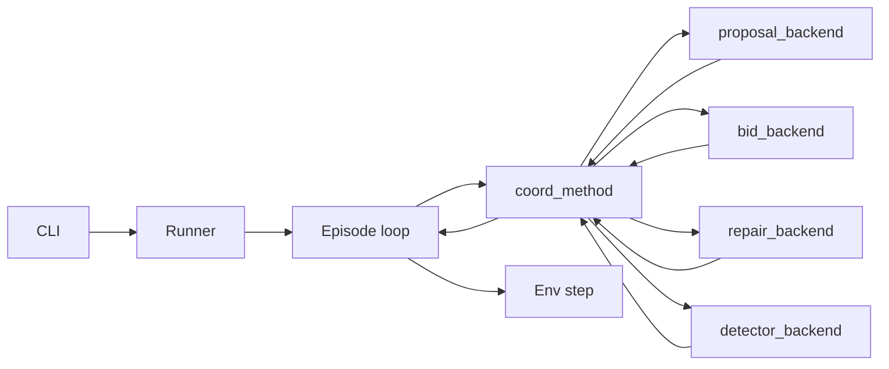

# Coordination Methods

Coordination methods produce per-agent actions for the PettingZoo Parallel env and are compared at scale in coord_scale and coord_risk. Each method implements the same interface and runs deterministically when using the deterministic backend. The registry is defined in `policy/coordination/coordination_methods.v0.1.yaml`; risk coverage is in `policy/coordination/method_risk_matrix.v0.1.yaml` and `policy/risks/risk_registry.v0.1.yaml`. For **learning-style methods** (e.g. MARL, evolution), see [Learning methods implementation strategy](learning_methods_implementation_strategy.md): deterministic track (CI-safe) vs study track (reproducible via seed-base and checkpoint hashing), and optional `metadata.coordination.learning` fields in results.

For a **detailed description of how each method works** (algorithms, data flow, invariants, and design choices), see [How coordination methods work (detailed)](coordination_methods_how_they_work.md). For **per-method SOTA status** (conformance pass_budget/pass_evidence, strictly-better test, envelope), run `python scripts/refresh_sota_checklist.py` from repo root to regenerate the dashboard table.

## Interface

- **CoordinationMethod**: `method_id`, `reset(seed, policy, scale_config)`, `propose_actions(obs, infos, t) -> dict[agent_id, action_dict]`, optional `on_step_result(step_outputs)`. Kernel-composed methods also implement `step(context) -> (actions, CoordinationDecision)` for decision tracing.
- **action_dict**: At least `action_index` (0=NOOP, 1=TICK, 2=QUEUE_RUN, 3=MOVE, 4=OPEN_DOOR, 5=START_RUN); optionally `action_type`, `args`, `reason_code`, `token_refs` for engine events. Actions are schema-valid and do not bypass RBAC or signature rules.
- **combine_submissions(submissions, obs, infos, t)** (optional): Combines per-agent submissions into a joint action dict. Used at scale when simulation-centric has N > N_max (per-agent policies) or agent-centric multi-agentic (N agent backends). Submission shape per method is defined in `policy/coordination/coordination_submission_shapes.v0.1.yaml`: `action` (default), `bid` (auction methods), or `vote` (consensus). Default implementation treats each submission as an action_dict and fills missing agents with NOOP.

### Where coordination runs

Coordination is **not** in the CLI. The CLI only parses arguments and invokes the runner (e.g. `run_benchmark`, `run_coordination_study`). The **runner** (`src/labtrust_gym/benchmarks/runner.py`) builds one `coord_method_instance` and a `scripted_agents_map`. The **episode loop** inside the runner does the following each step:

- If the method has `step(context)`: calls `coord_method.step(context)` (kernel-composed).
- Else if the method has repair and `_backend.generate_proposal`: runs `run_proposal_with_repair` with an internal `_propose_fn` that calls the coordinator backend's `generate_proposal(...)`.
- Else: calls `coord_method.propose_actions(obs_for_step, infos, step_t)`.

So one step = runner gets obs -> coord method calls backend(s) -> one or N LLM call(s) -> joint decision -> runner maps to per-agent actions -> env step. The CLI never sees per-step observations or LLM calls. The **propose_actions** (and step(context)) path does not run a runner-level shield; coordination methods are expected to produce valid actions. The engine still enforces RBAC and invariants on every action. Integrators who cannot assume a trusted coordinator should use agent-centric or combine path, or set `apply_runner_shield_on_propose_actions: true` in scale_config when implemented. See [Design choices](../architecture/design_choices.md) section 4.2 and 4.3.

## Domain scope

The coordination method contract (propose_actions, step, combine_submissions) is **domain-agnostic**: it consumes observations and returns action dicts. The only **implemented** domain is **hospital_lab** (blood sciences lane—a pathology lab: zones, specimens, MOVE, START_RUN, etc.). See [Glossary – Lab terminology](../reference/glossary.md#lab-terminology-hospital-lab-pathology-lab-blood-sciences-lab). All current coordination methods and tasks are defined for this domain. Adding another domain would require a new domain adapter, env/engine, and policy; see [Extension development](../agents/extension_development.md) and `domain_id` / `get_domain_adapter_factory`.

## Coordination kernel (ALLOCATION, SCHEDULING, ROUTING)

Methods can be implemented as a **composition of three components**, so allocation, scheduling, and routing are cleanly separated and swappable:

- **Allocator**: Chooses which agent(s) own which work items (specimens, runs, transports). Output: `AllocationDecision` (assignments, explain).
- **Scheduler**: Sequences owned work items per agent/device with deadlines and priorities. Output: `ScheduleDecision` (per-agent order, explain).
- **Router**: Produces safe movement/zone transitions (or reservations) to execute the scheduled steps. Output: `RouteDecision` (per-agent action_type and args, explain).

**KernelContext** provides a state snapshot (obs, infos, t), policy, scale config, seed, and a seeded RNG so every tie-break is deterministic. **compose_kernel(allocator, scheduler, router, method_id)** returns a `CoordinationMethod` that:

1. In each step, runs allocator -> scheduler -> router.
2. Builds a **CoordinationDecision** with stable hashes (state_hash, allocation_hash, schedule_hash, route_hash) and compact explain summaries.
3. Emits **COORD_DECISION** (in the audit/step results) with method_id, step_idx, seed, hashes, and explain fields (no large blobs).

Swapping only the router changes **route_hash** but not allocation_hash or schedule_hash; swapping the allocator changes allocation_hash and downstream hashes. This supports ablation and comparison of components. See `src/labtrust_gym/baselines/coordination/coordination_kernel.py`, `decision_types.py`, `compose.py`, and `kernel_components.py`.

### Example: kernel_centralized_edf

- **Allocator**: `CentralizedAllocator` (greedy by priority and colocation; compute_budget knob).
- **Scheduler**: `EDFScheduler` (earliest-deadline-first per agent; deterministic tie-break).
- **Router**: `TrivialRouter` (BFS move toward goal zone or START_RUN when colocated).

Run with: `labtrust run-benchmark --task coord_scale --coord-method kernel_centralized_edf --episodes 1 --seed 42 --out results.json`. Determinism: same seed yields identical decision hashes and per-agent actions; see `tests/test_coordination_kernel_determinism.py` and `tests/test_coordination_kernel_composition.py`.

## Event-sourced blackboard and partial observability

Instead of "agents magically see global state", coord_scale/coord_risk can use an explicit **BlackboardLog** and **ViewReplicas** so coordination is evaluated under configurable comms semantics:

- **BlackboardLog** (`src/labtrust_gym/coordination/blackboard.py`): Append-only events (facts) with deterministic ordering and replay. Each event has id, t_event, t_emit, type, payload_hash, payload_small. Head hash chains events for integrity.
- **ViewReplica** (`views.py`): Per-agent local view that lags behind the global log. `apply(event)` updates from a delivered event; `snapshot()` returns minimal state (queue_heads, zone_occupancy, device_status, specimen_statuses) used by policies.
- **CommsModel** (`comms_model.py`): Delivers log events to view replicas with configurable delay (seeded), drop_rate, reorder_window, duplicate_rate. **Perfect** mode (default) delivers all events immediately with no loss or reorder.

The **BlackboardHarness** (`harness.py`) is created when running coord_scale/coord_risk with a coordination method: each env step, facts are derived from engine step outputs and appended to the log; CommsModel delivers new events to replicas; replicas apply and expose snapshots. **KernelContext** receives optional `global_log` and `view_snapshots` so centralized methods can read from the full log and decentralized methods from per-agent views.

**Comms risk injections** (policy-driven): INJ-COMMS-DELAY-001, INJ-COMMS-DROP-001, INJ-COMMS-REORDER-001 configure the CommsModel (delay, drop rate, reorder window) so coord_risk can run with comms impairments and produce stable results with seed_base. Results v0.2 can include an optional **coordination** block with **comm.msg_count**, **comm.p95_latency_ms**, **comm.drop_rate**; summarize-results and the coordination study Pareto report include these columns when present. See `tests/test_blackboard_replay_determinism.py` and `tests/test_view_staleness_effect.py`.

## Methods

### 0. kernel_centralized_edf (composed)

Kernel-composed method: CentralizedAllocator + EDFScheduler + TrivialRouter. Emits COORD_DECISION each step with allocation/schedule/route hashes and explain summaries. Same interface as other methods; use for ablation (e.g. swap router only and compare route_hash).

**Expected vulnerabilities**: Same as centralized_planner (R-SYS-001, R-COMMS-001, R-FLOW-002).

---

### 0b. kernel_whca (composed, WHCA* router)

Kernel-composed method: CentralizedAllocator + EDFScheduler + **WHCARouter**. Uses a reservation table over the zone graph and windowed cooperative A* (WHCA*) for collision-free moves over a finite horizon (default 15 steps). Deadlock-safe fallback: wait-in-place (NOOP). Restricted door edges (INV-ROUTE-002) are never planned without valid token. Metrics: `coordination.route` with `replan_rate`, `mean_plan_time_ms`, `deadlock_avoids`. Scale configs in `policy/coordination/scale_configs.v0.1.yaml` (e.g. corridor_heavy: 200 agents). Run: `labtrust run-benchmark --task coord_scale --coord-method kernel_whca --episodes 1 --seed 42 --out results.json`. Determinism: same seed yields identical paths and decision hashes.

**Routing invariants** (coordination-layer, see `routing/invariants.py`): **INV-ROUTE-001** no two agents occupy same (time, node) over planned horizon; **INV-ROUTE-002** restricted door edges require valid token or are never planned; **INV-ROUTE-SWAP** (swap-collision invariant) no A→B and B→A at same time. Invariant IDs are exported from `routing/invariants.py` and used in simplex evidence and telemetry. The simplex shield (assurance/simplex.py) validates routes against all three plus RBAC and an optional duplicate (agent, device, start_time) schedule check. Evaluated in conformance safety_invariants and in tests (test_routing_invariants.py, test_safety_invariants.py).

---

### 0b2. kernel_scheduler_or / kernel_scheduler_or_whca (OR scheduling kernel)

Operations-research-grade baseline: **CentralizedAllocator** + **ORScheduler** (rolling-horizon) + **TrivialRouter** or **WHCARouter**. Policy: `policy/coordination/scheduler_or_policy.v0.1.yaml` (weights, horizon_steps, replan_cadence_steps, fairness_regularizer). Objective: weighted tardiness + throughput + violation penalties + coordination overhead. Priorities STAT/URGENT/ROUTINE, device capacity and colocation, zone and transport constraints; safety shields (RBAC/tokens) are enforced so the scheduler never proposes illegal START_RUN (no START_RUN for agents whose role disallows it or in restricted zone without token).

**Metrics**: `coordination.sched` (mean_plan_time_ms, replan_rate, deadlock_avoids), `coordination.alloc` (gini_work_distribution), `coordination.route` (when WHCA: replan_rate, deadlock_avoids). Deterministic and fast at scale.

**Complexity**: O(agents × work items) per step for allocation and schedule filtering; planning time reported in sched.mean_plan_time_ms.

**Failure modes**: Same as centralized (R-SYS-001 single point of failure, R-COMMS-001, R-FLOW-002); scheduler output always passes coordination contract (no illegal actions under strict RBAC/token mode). Official non-LLM coordination baseline for coord_scale and coord_risk (`benchmarks/baseline_registry.v0.1.yaml`: kernel_scheduler_or_v0).

---

### 0c. kernel_auction_edf / kernel_auction_whca (market-based allocator)

Kernel-composed methods: **AuctionAllocator** (sealed-bid auction) + EDFScheduler + TrivialRouter or WHCARouter. Allocation is no longer heuristic-only: each agent bids based on distance-to-work (routing graph), queue load, role constraints, and congestion-aware price signals (zone congestion, device queue price). Auction runs with a strict bid budget (`max_bids` per step); deterministic stable ordering and seeded tie-breaks. RBAC and token constraints are respected (allocator cannot assign forbidden actions). Metrics: `coordination.alloc` with **gini_work_distribution**, **mean_bid**, **rebid_rate**, and optional **alloc_emits** (e.g. BID_ANOMALY_DETECTED).

**Bid anomaly detector**: When enabled (default), outlier low bids are flagged (emit BID_ANOMALY_DETECTED, reason_code BID_ANOMALY_SPOOF_SUSPECTED); the flagged agent is contained (bids ignored for K steps). **INJ-BID-SPOOF-001**: Compromised agent publishes artificially low bids (injection via `scale_config.injection_id`); detector mitigates by containment. Method-risk matrix: market allocator partially covers congestion (R-FLOW-002), vulnerable to bid spoof (R-DATA-001) unless detector enabled. coord_risk smoke: run with `--coord-method kernel_auction_edf --injection INJ-BID-SPOOF-001`; results include `coordination.alloc`. See `tests/test_auction_respects_rbac.py`, `tests/test_bid_spoof_detection.py`.

---

### 1. centralized_planner

Single global planner builds a worklist and assigns agents to the next best action using greedy heuristics:

- Prioritizes STAT > URGENT > ROUTINE.
- Respects colocation (agent must be in same zone as device for START_RUN).
- Prefers shortest queue and device availability.
- **Compute budget**: Optional knob to limit assignments per step and simulate planner saturation at scale.

**Expected vulnerabilities** (risk IDs from `policy/risks/risk_registry.v0.1.yaml` and `policy/coordination/method_risk_matrix.v0.1.yaml`): R-SYS-001 (single point of failure, DoS), R-COMMS-001 (hub identity/spoofing), R-FLOW-002 (progress/deadlock under load).

---

### 2. hierarchical_hub_rr

Hub assigns tasks to cells (zones/sites); within each cell, local rapid-response handles exceptions (critical, QC fail, door breach).

- Message delay between hub and cells is modeled deterministically as a function of scale (e.g. steps delay).
- Local RR takes precedence over delayed hub assignments.

**Expected vulnerabilities**: R-SYS-002, R-COMMS-002 (message auth / poisoning), R-FLOW-002 (see [Risk register](../risk-and-security/risk_register.md)).

---

### 2b. hierarchical_hub_local (Hub + local controllers, handoff protocol)

Hub assigns work at macro-level to regions (deterministic partition of zones); each region has a LocalController (EDF + TrivialRouter). HandoffEvent protocol: hub-to-region assignment requires ACK within T steps; missing ACK triggers escalation. Metrics: coordination.hierarchy (cross_region_handoffs, handoff_fail_rate, escalations). At large N in coord_scale with comms model active, can reduce comm.msg_count vs centralized. Registry: required_controls include handoff_ack_deadline. See hierarchical/, test_hierarchy_handoff_protocol.py, test_hierarchy_determinism.py.

---

### 3. market_auction (contract net)

Tasks announce; agents bid by estimated cost/time; auctioneer selects winners.

- Optional **collusion** toggle for risk injection (e.g. one agent biases bids).
- Deterministic given seed and observations.

**Expected vulnerabilities**: R-DATA-001 (untrusted payload in bids/awards), R-COMMS-002, R-TOOL-006.

---

### 4. gossip_consensus

Local load balancing: agents share queue head and local load; converge to a stable assignment using a fixed small K gossip rounds per step.

- Degrades gracefully under message loss (deterministic drop model).
- No central auctioneer; assignment by consensus within rounds.

**Expected vulnerabilities**: R-COMMS-002 (poisoning amplification), R-DATA-003, R-FLOW-002.

---

### 5. swarm_reactive

Purely local rules; zero global state.

- If near restricted door and alarm: close/exit (TICK or MOVE away).
- If device queue empty and specimens waiting: QUEUE_RUN (when colocated).
- If QC fail: rerun path (local heuristic).

**Expected vulnerabilities**: R-TOOL-001, R-FLOW-001, R-SYS-001 (see [Risk register](../risk-and-security/risk_register.md)).

---

### 5b. consensus_paxos_lite (decentralized)

Leader-based agreement on a single global digest (e.g. device -> queue_head) in bounded rounds. Leader = `agents[t % n]`; leader proposes digest from `queue_by_device`; all agents use the digest for local actions (move toward device zones, START_RUN when colocated with head, QUEUE_RUN when at device with queue but no head). No central auctioneer; fits existing bus and identity.

**Expected vulnerabilities**: R-COMMS-002 (poisoning of proposed value), R-DATA-003, R-FLOW-002. See [fidelity notes](fidelity_notes.md).

---

### 5c. swarm_stigmergy_priority (swarm)

Priority-weighted stigmergy: pheromone per zone with decay; deposit on QUEUE_RUN/START_RUN. Agents follow gradient (move to adjacent zone with highest pheromone); if no gradient, fallback BFS toward device zones with work. Handles restricted zone (TICK when frozen). Params: pheromone_decay, pheromone_deposit.

**Expected vulnerabilities**: R-TOOL-001, R-DATA-001, R-FLOW-002. See [fidelity notes](fidelity_notes.md).

---

### 6. marl_ppo

If Stable-Baselines3 (and gymnasium) is installed, reuses the existing PPO policy wrapper for evaluation. If not installed, a fallback raises a clear error and the method is skipped in studies unless the `[marl]` extra is present.

**Expected vulnerabilities**: R-DATA-002, R-FLOW-002, R-TOOL-004.

---

### 7. llm_constrained

Reuses the existing `baselines/llm/agent.py` (LLMAgentWithShield) as a CoordinationMethod: one LLM agent instance, `propose_actions` calls `act(obs[agent_id], agent_id)` per agent. Uses the existing constrained decoder stack; logs LLM_DECISION (already present in the agent meta) into step outputs when available.

**Expected vulnerabilities**: R-TOOL-001, R-TOOL-005, R-CAP-001, R-DATA-001.

---

## Registry and factory

### 7b. llm_repair_over_kernel_whca (repair-over-kernel)

Base plan is produced by a deterministic kernel method (default: **kernel_whca**). The LLM is used only as a repairer/sanitizer when: (1) the shield rejects the kernel action set, (2) a security detector flags comms poisoning, inconsistent view, or spoofed identity, or (3) plan staleness exceeds policy limit (e.g. coordination.timing.p95_view_age_ms). Flow: kernel plan -> shield validate -> if blocked or flagged -> build deterministic repair input (scale_config snapshot, last accepted plan summary, blocked actions with reason codes, constraint summary, red-team flags) -> call LLM repair backend -> re-shield repaired plan -> execute or fallback to NOOP.

**Repair input** is canonicalized (stable key order, no timestamps) so that same logical input yields same JSON and same hash; determinism in llm_offline is preserved via a deterministic repair backend (seed + repair_input_hash). **Metrics**: optional `coordination.llm_repair` block in results v0.2: `repair_call_count`, `repair_success_rate`, `repair_fallback_noop_count`, `mean_repair_latency_ms` (null offline), `total_repair_tokens` (0 offline). Required controls: signed_actions, message_auth, shield_execute, repair_loop. Compatible injections: INJ-COMMS-POISON-001, INJ-ID-SPOOF-001, INJ-LLM-PROMPT-INJECT-COORD-001. coord_risk with INJ-COMMS-POISON-001 or INJ-ID-SPOOF-001 runs produce sec metrics and nonzero repair calls when the runner sets repair triggers. Run: `labtrust run-benchmark --task coord_risk --coord-method llm_repair_over_kernel_whca --injection INJ-COMMS-POISON-001 --episodes 1 --seed 42 --out results.json`.

---

- **Registry**: `policy/coordination/coordination_methods.v0.1.yaml` lists `method_id`, name, coordination_class, scaling_knobs, known_weaknesses (risk_id), required_controls, compatible_injections, default_params. Includes kernel-composed methods (e.g. kernel_centralized_edf, kernel_whca, kernel_auction_edf, kernel_auction_whca) and hierarchical_hub_local; **kernel_auction_whca_shielded** is the auction+WHCA method wrapped by the Simplex shield (see assurance/simplex.py); **llm_repair_over_kernel_whca** is repair-over-kernel (see above).
- **Factory**: `make_coordination_method(method_id, policy, repo_root=None, scale_config=None, **kwargs)` loads default_params from the registry and instantiates the corresponding method. For `llm_constrained`, `llm_agent` must be passed; for `marl_ppo`, a trained model path can be passed when SB3 is available.

## Usage

- **CLI**: `labtrust run-benchmark --task coord_scale --coord-method centralized_planner --episodes 1 --seed 42 --out results.json`
- **Runner**: For coord_scale and coord_risk, when `--coord-method` is set, the benchmark uses the chosen coordination method to drive all agents; actions are converted to `(action_index, action_info)` and passed to `env.step()`. RBAC and signature rules are not bypassed; the env and engine enforce them as for scripted/LLM baselines.

## Coordination done checklist

Acceptance gates for coordination work before UI/Lovable work starts. All items must pass.

- **Policy validation:** `labtrust validate-policy` — risk registry, method registry, method-risk matrix, and coordination study spec validate.
- **Tasks runnable:** coord_scale with `--coord-method centralized_planner`; coord_risk with `--coord-method market_auction --injection INJ-COLLUSION-001`.
- **At least 5 coordination methods:** centralized_planner, hierarchical_hub_rr, market_auction, gossip_consensus, swarm_reactive; SOTA: consensus_paxos_lite, swarm_stigmergy_priority (optional: llm_constrained, marl_ppo). Verify with `labtrust run-benchmark --task coord_scale --episodes 1 --coord-method <method_id> --out /tmp/out.json` for each.
- **At least 5 injections:** INJ-COMMS-POISON-001, INJ-ID-SPOOF-001, INJ-DOS-PLANNER-001, INJ-COLLUSION-001, INJ-TOOL-MISPARAM-001, INJ-MEMORY-POISON-001 (or equivalent). INJ-ID-SPOOF-001 must yield attack_success_rate=0 when strict_signatures=True.
- **Determinism:** Scale generator and injections determinism (pytest tests/test_coordination_scale_determinism.py, tests/test_risk_injections_deterministic.py).
- **Study runner:** run-coordination-study emits summary/pareto.md with Pareto front and robust winner.
- **Benchmark card updated:** coordination suite, methods, injections, metrics (see [Benchmark card](../benchmarks/benchmark_card.md)).
- **CI smoke:** validate-policy, pytest coordination tests, one-episode coord_scale and coord_risk runs without secrets.

## Coordinator guardrails and multi-LLM protocol tests

This subsection lists which tests cover coordinator guardrails and multi-LLM (round_robin, debate, agentic) and how to run them.

1. **Coordinator guardrails:** Unit tests in `tests/test_coordinator_guardrails.py` and `tests/test_coordinator_guardrails_e2e.py`. E2E: full episode (`test_e2e_coordinator_guardrails_full_episode`), round_robin through runner (`test_e2e_round_robin_through_runner`), attribution structure and by_backend (`test_e2e_attribution_structure_with_trace`). Unit tests trigger circuit open and rate limit and assert safe fallback (reason codes **CIRCUIT_BREAKER_OPEN**, **RATE_LIMITED**).

2. **Multi-LLM protocol (round_robin):** `test_e2e_round_robin_through_runner` in `tests/test_coordinator_guardrails_e2e.py`, `test_llm_auction_bidder_round_robin_protocol` in `tests/test_coord_llm_auction_bidder_smoke.py`.

3. **Debate and agentic:** Smoke tests in `tests/test_coord_llm_debate_smoke.py` and `tests/test_coord_llm_agentic_smoke.py`. Live (real API) tests in `tests/test_openai_live.py` when `LABTRUST_RUN_LLM_LIVE=1` and `OPENAI_API_KEY` are set.

4. **How to run:** Offline: `pytest tests/test_coordinator_guardrails_e2e.py tests/test_coord_llm_auction_bidder_smoke.py tests/test_coord_llm_debate_smoke.py tests/test_coord_llm_agentic_smoke.py -v`. Live coord tests: `pytest tests/test_openai_live.py -m live -v`. To run only coordinator guardrails and multi-LLM tests: `pytest tests/ -k "guardrail or round_robin or attribution_structure or coord_llm_auction_bidder or coord_llm_debate or coord_llm_agentic or guardrail_trigger" -v`.

Optionally, `pytest -q tests/test_coordination_*` (or the explicit list above) covers coordinator guardrails and multi-LLM; no separate CI job is required unless desired. In CI, the same `-k` subset can be used to run only these tests (e.g. Coordinator guardrails and multi-LLM: `test_coordinator_guardrails*`, `test_coord_llm_*`).

## SOTA fidelity checklist

To honestly claim SOTA, methods need **algorithmic fidelity** (implementation matches the described algorithm) and **evaluation fidelity** (benchmarks measure the right quantities and compare to meaningful baselines).

**Algorithmic fidelity:** Ripple protocol propagates via neighborhoods (neighbor graph, signed bus, conflict resolution in ripple_effect.py). Experience sharing changes policy/params (routing_weights from summaries in group_evolving). Evolution = selection + mutation + inheritance (evolution_loop.py: select_top_k, mutate_genome, recombine_genomes). Updates logged and seeded (checkpoints, mutation_log.jsonl, get_learning_metadata).

**Evaluation fidelity:** coord_scale measures scale effects (comm.msg_count, comm.p95_latency_ms, coordination.stale_action_rate in summary_coord.csv). coord_risk measures robustness (sec.attack_success_rate, sec.stealth_success_rate, robustness.resilience_score). Baselines: kernel_whca, market_auction, hierarchical_hub_rr, consensus_paxos_lite, swarm_stigmergy_priority in study spec and Layer 1 / coordination-nightly scripts.

See source: `src/labtrust_gym/baselines/coordination/ripple_effect.py`, `group_evolving/`, `coordination_study_runner.py`, `benchmarks/metrics.py`, `policy/coordination/coordination_study_spec.v0.1.yaml`.
