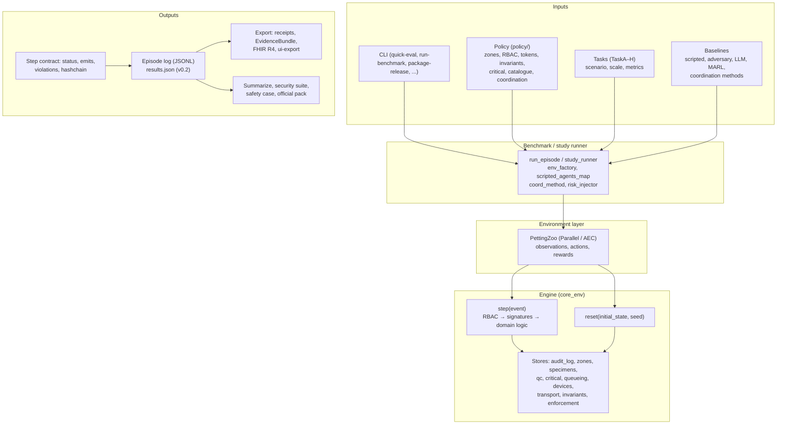
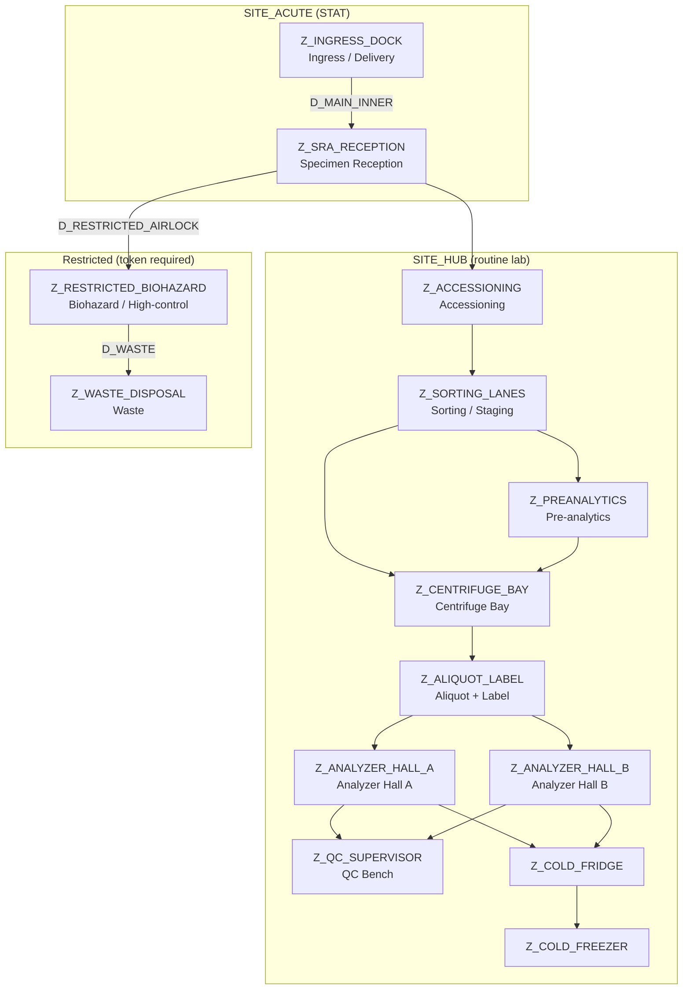

# Architecture diagrams

High-level visual overview of the main pipeline and of the HSL (Blood Sciences Lab) topology we model. Diagrams are in Mermaid; they render on GitHub and in MkDocs when using a Mermaid plugin (e.g. `mkdocs-mermaid2-plugin`). Otherwise copy the code into [Mermaid Live](https://mermaid.live) to view.

---

## 1. Main pipeline (high-level)

End-to-end flow from user/CLI through policy and tasks, environment, engine, and outputs.

**Summary:** The CLI and config (policy, task, baseline) drive the benchmark runner. The runner builds an environment (optionally PettingZoo-wrapped) over the core engine. Each step goes through RBAC, signatures, and domain logic; the engine returns the step contract and appends to the audit log. Episode logs and results feed export (receipts, FHIR, UI bundle) and reporting (summarize, security suite, safety case, official pack).

---

## 2. HSL lab topology (modeled architecture)

Zone layout and specimen flow for the Blood Sciences Lab (HSL) at 60 Whitfield Street (automation hub). Two sites: **SITE_ACUTE** (STAT ingress) and **SITE_HUB** (routine lab). Arrows show permitted graph edges; the restricted branch requires a token. Devices are placed in the zones listed.

**Device placement (from zone_layout_policy):**

| Zone | Devices |
|------|---------|
| Z_CENTRIFUGE_BAY | DEV_CENTRIFUGE_BANK_01 |
| Z_ALIQUOT_LABEL | DEV_ALIQUOTER_01 |
| Z_ANALYZER_HALL_A | DEV_CHEM_A_01, DEV_HAEM_01 |
| Z_ANALYZER_HALL_B | DEV_CHEM_B_01, DEV_COAG_01 |

**Transport:** Specimens can be dispatched from SITE_ACUTE to SITE_HUB (route ACUTE_TO_HUB; transport time and temp drift defined in `policy/sites/sites_policy.v0.1.yaml`). Chain-of-custody and temperature bands are enforced by the engine.

**Roles (RBAC):** Reception (SRA, accessioning), Runner (movement, pre-analytics, analytics), Pre-analytics, Analytics, QC, Supervisor, Biohazard (restricted area and waste). Restricted door D_RESTRICTED_AIRLOCK requires TOKEN_RESTRICTED_ENTRY and role ROLE_BIOHAZARD or ROLE_SUPERVISOR.

---

See [architecture.md](architecture.md) for component-level description and [repository_structure.md](repository_structure.md) for directory layout.
