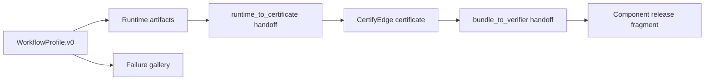

# PCS workflow implementation guide

LabTrust-Gym is the **reference implementation** for protocol-native PCS workflows.

Index: [pcs-reference-implementation.md](pcs-reference-implementation.md) This guide
explains how to add a second workflow (computation pipeline, tool-use agent, or another domain)
using the same five-layer architecture as `examples/pcs_qc_release/`.

## Architecture overview



| Layer | Artifact(s) | Owner |
|-------|-------------|--------|
| 1. WorkflowProfile | `workflow_profile.v0.json` | Workflow repo |
| 2. Runtime | `trace.json`, `runtime_receipt.json`, `science_claim_bundle.pending.json` | Workflow runtime |
| 3. runtime → certificate | `handoff_to_certifyedge.json` | Workflow + PCS handoff schema |
| 4. Certificate attach | `trace_certificate.json`, `science_claim_bundle.certified.json` | CertifyEdge + workflow attach step |
| 5. bundle → verifier | `handoff_to_pf.json` | Workflow |
| 6. Component fragment | `labtrust_release_fragment.json` (name may vary) | Workflow component |
| 7. Failure gallery | `failures/<case>/failure_case_manifest.json` | Workflow + CI |

## Step 1 — WorkflowProfile.v0

Author `workflow_profile.v0.json` beside your example workflow:

- `workflow_id`, `property_id`, `schema_version`
- `handoffs[]` with kinds `runtime_to_certificate` and `bundle_to_verifier`
- `certificate_artifacts`, `failure_modes`, `required_admission_profile` (if applicable)

Materialize digest fields with your repo’s profile tooling (see
`examples/pcs_qc_release/scripts/materialize_workflow_profile.py`).

Reference: `examples/pcs_qc_release/workflow_profile.v0.json`.

## Step 2 — Implement `PCSWorkflow`

Subclass `labtrust_gym.pcs.workflows.base.PCSWorkflow` and register in `workflows/registry.py`.

Required surface (domain-neutral):

```python
class MyWorkflow(PCSWorkflow):
    @property
    def workflow_id(self) -> str: ...  # from profile

  def execute_runtime(self, scratch_dir: Path) -> Path: ...
  def export_runtime_receipt(self, run_dir, out_path, ...) -> dict: ...
  def export_pending_bundle(self, run_dir, out_path, ...) -> dict: ...
  def generate_failure_case(self, failure_id: str, out_dir: Path) -> Path: ...
```

Shared PCS steps (do not reimplement):

- `generate_runtime_artifacts(out_dir)`
- `emit_runtime_to_certificate_handoff(out_dir)`
- `attach_certificate(certificate_path, out_dir)`
- `emit_bundle_to_verifier_handoff(out_dir)`
- `emit_component_release_fragment(out_dir)`
- `regenerate_protocol_package(out_dir, ...)`

Reference: `src/labtrust_gym/pcs/workflows/qc_release.py`.

Starter copy: `templates/pcs_workflow_template/`.

## Step 3 — Runtime artifacts

`execute_runtime` runs your domain logic and writes at least `trace.json` (and usually
`run_meta.json`) under a scratch directory.

`generate_runtime_artifacts` exports:

1. Canonical `trace.json` (normalized `trace_hash`)
2. `runtime_receipt.json` (RuntimeReceipt.v0)
3. `science_claim_bundle.pending.json` (ScienceClaimBundle.v0, pending)

## Step 4 — runtime_to_certificate handoff

`emit_runtime_to_certificate_handoff` writes `handoff_to_certifyedge.json` using handoff ids from
the profile (`runtime_to_certificate` kind).

Then invoke CertifyEdge (`emit-pcs-certificate`) with that handoff to produce
`trace_certificate.json`.

## Step 5 — Certificate attachment

`attach_certificate(certificate_path, out_dir)` merges the certificate into the pending bundle
→ `science_claim_bundle.certified.json`.

## Step 6 — bundle_to_verifier handoff

`emit_bundle_to_verifier_handoff` writes `handoff_to_pf.json` (profile kind
`bundle_to_verifier`).

## Step 7 — Component release fragment

`emit_component_release_fragment` publishes the workflow component’s release slice (LabTrust uses
`labtrust_release_fragment.json` with provenance commits).

## Step 8 — Failure gallery

For each `failure_modes` entry in the profile:

1. Create `failures/<failure_case_id>/`
2. Populate `artifacts/` (release-shaped tree)
3. Write `failure_case_manifest.json` per `schemas_or_docs/FailureCaseManifest.v0.md`
4. Verify the case fails the documented check (`validate_failure_gallery.py`)

Generate cases: `labtrust generate-failure-gallery` (QC reference) or
`workflow.generate_failure_case(case_id, out_dir)`.

## Clean regeneration and benchmarking

```bash
labtrust regenerate-release-protocol \
  --pcs-core ../pcs-core \
  --certifyedge-bin certifyedge \
  --out examples/<your_workflow>/release
```

Writes `regeneration_report.json` with:

`workflow_id`, `artifacts_written`, `artifact_hashes`, `handoffs_written`, `certificate_id`,
`trace_hash`, `certified_bundle_hash`, `duration_ms`, `status`, `failure_code`.

Use this report for `pcs-bench` drift detection and CI timing gates.

CI validators (LabTrust reference):

- `examples/pcs_qc_release/scripts/ci_validate_regeneration_report.py`
- `examples/pcs_qc_release/scripts/ci_validate_failure_manifests.py`
- `examples/pcs_qc_release/scripts/materialize_regeneration_report.py` (refresh report without CertifyEdge)

JSON Schema (validated on write and in CI):

- `policy/schemas/pcs/RegenerationReport.v0.schema.json`
- `policy/schemas/pcs/FailureCaseManifest.v0.schema.json`

## LabTrust QC reference map

| Guide layer | QC release path |
|-------------|-----------------|
| Profile | `examples/pcs_qc_release/workflow_profile.v0.json` |
| Runtime scenario | `valid_workflow.yaml` |
| Release package | `examples/pcs_qc_release/release/` |
| Failure gallery | `examples/pcs_qc_release/failures/` |
| Workflow class | `QcReleaseWorkflow` in `pcs/workflows/qc_release.py` |

See also `docs/reference-workflow-template.md` for PCS chain and PF/SM notes specific to the
hospital lab demo.
