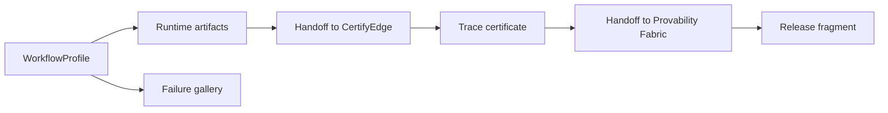

# Extending PCS workflows

Use this guide to add a second domain workflow (computation pipeline, tool-use agent, or another property) using the same trust-loop pattern as the QC-release reference.

Starter copy: [templates/pcs_workflow_template/](../../templates/pcs_workflow_template/).

QC-release reference: `examples/pcs_qc_release/`, `src/labtrust_gym/pcs/workflows/qc_release.py`.

## Trust-loop layers



| Layer | Artifact(s) | Owner |
|-------|-------------|--------|
| Workflow profile | `workflow_profile.v0.json` | Your workflow repo |
| Runtime | `trace.json`, `runtime_receipt.json`, `science_claim_bundle.pending.json` | Workflow runtime |
| Runtime to certificate | `handoff_to_certifyedge.json` | Workflow + pcs-core handoff schema |
| Certificate attach | `trace_certificate.json`, `science_claim_bundle.certified.json` | CertifyEdge + workflow attach step |
| Bundle to verifier | `handoff_to_pf.json` | Workflow |
| Component fragment | e.g. `labtrust_release_fragment.json` | Workflow component |
| Failure gallery | `failures/<case>/failure_case_manifest.json` | Workflow + CI |

## Step 1 — WorkflowProfile

Author `workflow_profile.v0.json` beside your example workflow:

- `workflow_id`, `property_id`, `schema_version`
- `handoffs[]` with kinds `runtime_to_certificate` and `bundle_to_verifier`
- `certificate_artifacts`, `failure_modes`, `required_admission_profile` (if applicable)
- `status_policy` with forbidden transitions (LabTrust must never emit `ProofChecked`)
- `formalization.formalization_scope`: use `trust_envelope_only` when Lean covers the trust envelope only

Materialize digest fields with your profile tooling (see `examples/pcs_qc_release/scripts/materialize_workflow_profile.py`).

Validate:

```bash
pcs validate examples/<workflow>/workflow_profile.v0.json
pcs registry check-artifact examples/<workflow>/workflow_profile.v0.json
```

## Step 2 — Implement PCSWorkflow

Subclass `labtrust_gym.pcs.workflows.base.PCSWorkflow` and register in `workflows/registry.py`.

Implement workflow-specific methods:

- `execute_runtime(scratch_dir) -> Path`
- `export_runtime_receipt`, `export_pending_bundle`
- `generate_failure_case(failure_id, out_dir)`

Reuse base-class protocol steps (do not reimplement):

- `generate_runtime_artifacts`, `emit_runtime_to_certificate_handoff`
- `attach_certificate`, `emit_bundle_to_verifier_handoff`
- `emit_component_release_fragment`, `regenerate_protocol_package`

## Step 3 — Runtime artifacts

From a deterministic run, export:

1. Canonical `trace.json`
2. `runtime_receipt.json` (`RuntimeReceipt.v0`, status `RuntimeObserved`)
3. `science_claim_bundle.pending.json` (pending `ScienceClaimBundle.v0`)

## Step 4 — CertifyEdge handoff and certificate

```bash
labtrust emit-handoff-to-certifyedge \
  --trace trace.json \
  --runtime-receipt runtime_receipt.json \
  --property-id <your.property_id> \
  --out handoff_to_certifyedge.json
```

CertifyEdge produces `trace_certificate.json`. Attach:

```bash
labtrust attach-certificate \
  --bundle science_claim_bundle.pending.json \
  --certificate trace_certificate.json \
  --out science_claim_bundle.certified.json
```

Certified bundles use `claim_artifact.status: CertificateChecked`. If the trace hash diverges after attach, mark the claim **Stale**.

## Step 5 — Provability Fabric handoff

```bash
labtrust emit-handoff-to-pf \
  --bundle science_claim_bundle.certified.json \
  --out handoff_to_pf.json
```

Provability Fabric owns proof admission (`ProofChecked` on `VerificationResult.v0`). LabTrust artifacts must not carry `ProofChecked`.

## Step 6 — Release fragment and verification

```bash
labtrust emit-release-fragment --release-dir <release-dir>
labtrust verify-release-protocol --release-dir <release-dir> --pcs-core ../pcs-core
labtrust check-status-policy --release-dir <release-dir>
```

## Step 7 — Failure gallery and benchmarks

```bash
labtrust generate-failure-gallery \
  --workflow <workflow_id> \
  --out examples/<workflow>/failures

labtrust generate-benchmark-cases \
  --workflow <workflow_id> \
  --out examples/<workflow>/benchmark \
  --seed 42
```

Each failure case directory should include `artifacts/`, `expected_failure.json`, and `repair_hint.json`. See [benchmark-profile.md](benchmark-profile.md).

## Clean regeneration

```bash
labtrust regenerate-release-protocol \
  --pcs-core ../pcs-core \
  --certifyedge-bin certifyedge \
  --out examples/<workflow>/release
```

Writes `regeneration_report.json` for drift detection. CI validators in `examples/pcs_qc_release/scripts/ci_validate_*.py` can be adapted for your workflow.

Proof-obligation readiness (Lean extraction, not Lean execution in CI):

- `proof_obligation_hints.json`, `proof_obligation_identifiers.json`
- `formalization_readiness_report.json`

## Status boundaries (LabTrust)

| Stage | `claim_artifact.status` |
|-------|-------------------------|
| Pending bundle | `RuntimeObserved` |
| Certified bundle | `CertificateChecked` |
| After trace mutation | `Stale` |
| Failed runtime demo | `Rejected` or failed receipt under `failures/` only |
| Proof admission | **Forbidden** on LabTrust artifacts |

## Scientific Memory

After Provability Fabric signs the bundle, import the signed claim into Scientific Memory. The QC reference documents import commands in [pcs_v01_clean_chain.md](../pcs_v01_clean_chain.md).
