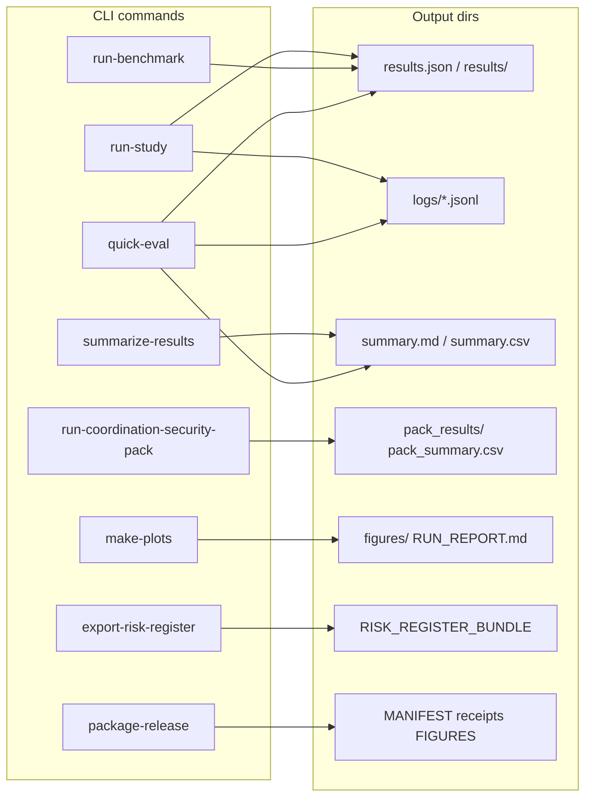

# LabTrust-Gym: Outputs and Results Reference

This repo is **LabTrust-Gym**: a multi-agent environment (PettingZoo/Gym) for a self-driving hospital lab with a reference trust skeleton (RBAC, signed actions, audit log, invariants). Outputs are produced by the `labtrust` CLI, scripts, and CI; most go under a configurable output directory (default `labtrust_runs/` or `--out` / `--out-dir`).

---

## 1. Result types and where they live

| Category | Location / path pattern | Produced by | Pipeline |
|----------|--------------------------|-------------|----------|
| **Benchmark results** | `<out>/results.json` or `<out_dir>/results/<task>_<suffix>.json` | `run-benchmark`, `eval-agent`, `quick-eval`, `generate-official-baselines` | Any |
| **Episode logs** | `<out_dir>/logs/*.jsonl`, `episodes.jsonl` | Benchmark/study runs, quick-eval | Any |
| **Summaries** | `<out>/summary.md`, `<out>/summary.csv`, `summary_v0.2.csv`, `summary_v0.3.csv` | `quick-eval`, `summarize-results`, `generate-official-baselines` | Any |
| **Coordination pack** | `<out>/pack_results/`, `pack_summary.csv`, `pack_gate.md`, `SECURITY/` | `run-coordination-security-pack`, `run-coordination-study` | Any (security pack: deterministic only) |
| **Study outputs** | `<out>/manifest.json`, `results/<condition_id>/results.json`, `logs/<condition_id>/episodes.jsonl` | `run-study`, `run-coordination-study` | Any |
| **Coordination summaries** | `<out>/summary/sota_leaderboard.csv`, `sota_leaderboard.md`, `method_class_comparison.csv|.md` | `summarize-coordination`, `run-coordination-study` | Any |
| **Plots** | `<run>/figures/` (PNG/SVG), `data_tables/`, `RUN_REPORT.md` | `make-plots` | Any |
| **Security** | `<out>/SECURITY/attack_results.json`, `coordination_risk_matrix.md|csv` | `run-security-suite`, coordination security pack | Any |
| **Safety / risk** | `<out>/SAFETY_CASE/safety_case.json`, `safety_case.md`; `risk_register_out/RISK_REGISTER_BUNDLE.v0.1.json` | `safety-case`, `export-risk-register` | Any |
| **Evidence / release** | EvidenceBundle dirs, `RELEASE_MANIFEST.v0.1.json`, `receipts/`, `FIGURES/` | `export-receipts`, `verify-release`, `package-release`, `build-release-manifest` | Any |
| **Transparency** | `out/TRANSPARENCY_LOG/root.txt`, `log.json`, `proofs/` | CI (e.g. [CI](../operations/ci.md)) | Deterministic only |
| **PPO** | `labtrust_runs/ppo_out/model.zip` (or `LABTRUST_PPO_MODEL`) | `train-ppo` | Deterministic only (seeded) |
| **Build** | `dist/`, `build/` | `scripts/build_repro.sh`, setuptools; release workflow | — |
| **Docs** | `site/` | MkDocs (`mkdocs build`) | — |

Canonical baseline result files used for regression live in `benchmarks/baselines_official/v0.2/results/`.

---

## 1.1 Pipeline modes and result audit

Benchmarks run in exactly three **pipeline modes**: **deterministic** | **llm_offline** | **llm_live** (see [Pipelines in the README](../../README.md#pipelines) and [Live LLM — Pipeline modes](../agents/llm_live.md#pipeline-modes) for canonical definitions).

- **deterministic** — Scripted agents only; no LLM interface. Default for CI, regression, and most CLI commands. Same seed yields same results; no network.
- **llm_offline** — LLM agent/coordination interface with a deterministic backend only (fixture lookup or seeded RNG). No network; reproducible given seed or fixtures.
- **llm_live** — Live LLM API (OpenAI, Ollama, etc.). Requires `--allow-network`; runs are non-deterministic and record `non_deterministic: true`.

**Result files always record pipeline and audit fields.** Every benchmark `results.json` (and thus summaries or studies built from it) includes **pipeline_mode**, **llm_backend_id**, **allow_network**, and **non_deterministic**. Consumers can tell deterministic vs LLM runs when inspecting any result file or UI export (e.g. `index.json`).

**Canonical baselines and regression.** The files under `benchmarks/baselines_official/v0.2/results/` are produced by **deterministic** runs only (`generate-official-baselines`). Regression and CI use deterministic pipelines; official baseline comparison is only valid against deterministic outputs.

---

## 2. Main result schemas and formats

- **Benchmark results**: `policy/schemas/results.v0.2.schema.json` (CI-stable), `policy/schemas/results.v0.3.schema.json` (paper-grade with quantiles/CI). Metrics (throughput, p95_turnaround_s, violations, blocked_by_reason_code, etc.) are defined in [metrics contract](../contracts/metrics_contract.md). The optional **metadata.llm_attribution_summary** (cost/latency per backend and agent) is only present when `LABTRUST_LLM_TRACE=1`; see [Observability — Attribution in results](observability.md#attribution-in-results).
- **Summaries**: `summary_v0.2.csv` (CI-stable aggregates), `summary_v0.3.csv` (adds quantiles/CI), `summary.md` (markdown table + optional Run info). See metrics contract for column semantics.
- **Risk/evidence**: `RISK_REGISTER_BUNDLE.v0.1.json`, EvidenceBundle v0.1, FHIR export; schemas under `policy/schemas/` and contracts under [contracts](../contracts/index.md).

---

## 3. CLI output contract

Every CLI command's exit code, minimal smoke args, and **expected output paths** are specified in [CLI output contract](../contracts/cli_contract.md). That table is the single source of truth for "what file(s) appear where" for each command; smoke tests in `tests/test_cli_smoke_matrix.py` assert these paths.

---

## 4. High-level flow of outputs

---

## 5. Quick reference: commands that write key outputs

| If you want... | Command(s) | Default pipeline |
|----------------|------------|------------------|
| Single benchmark result file | `run-benchmark --out <path>` (writes results.json) | deterministic |
| Quick run + markdown summary | `quick-eval` (writes under `labtrust_runs/quick_eval_*/`) | deterministic |
| Aggregated CSV/MD across runs | `summarize-results --in <dir_or_file> --out <dir>` | (consumes existing results) |
| Coordination SOTA / method comparison | `run-coordination-study`, `summarize-coordination` | deterministic (study: configurable) |
| Security attack results | `run-security-suite --out <dir>` | deterministic |
| Safety case + risk bundle | `safety-case --out <dir>`, `export-risk-register --out <dir>` | (no benchmark run) |
| Plots for a run | `make-plots --run <dir>` | (consumes existing run) |
| Full release artifact (paper-ready) | `package-release --profile paper_v0.1 --out <dir>` | deterministic |
| Official baseline results | `generate-official-baselines --out <dir>` (e.g. `benchmarks/baselines_official/v0.2/`) | deterministic only |

All paths above are relative to CWD or the given `--out` / `--out-dir`; see [CLI output contract](../contracts/cli_contract.md) for exact filenames and schema references.
