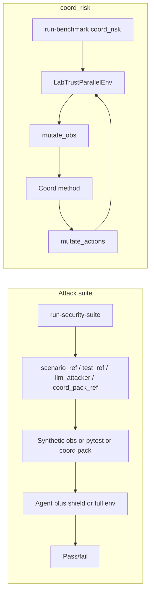

# Security flows and entry points

This document clarifies the two distinct security-related flows in the repo: the **security attack suite** (agent/shield regression plus optional system-level coordination-under-attack) and **coord_risk** (coordination-under-attack benchmark using the PZ env and risk injectors).

## Security attack suite

**Entry point:** `labtrust run-security-suite`

- Loads `policy/golden/security_attack_suite.v0.1.yaml`.
- Runs attacks via:
  - **scenario_ref**: Prompt-injection in-process; synthetic observation (no PZ env); exercises agent and shield in isolation.
  - **test_ref**: Pytest subprocess; allowlisted attack tests (tool sandbox, memory, etc.); no PZ env.
  - **llm_attacker**: Live LLM generates adversarial payloads; synthetic obs; agent/shield must block. No env.
  - **coord_pack_ref**: System-level coordination-under-attack; runs the full PZ env plus coordination pack (same loop as `run-coordination-security-pack`). Requires `.[env]`; use `--skip-system-level` to skip these entries when env is not installed.
- The suite uses the PZ env **only for coord_pack_ref entries**. When env is not available (or `--skip-system-level` is set), coord_pack_ref entries are skipped and recorded as passed with `skipped: true`.

The agent/shield path (scenario_ref, llm_attacker) uses the **same observation shape** as the PZ env so the same agent code can be tested; it does not run the env. See [Simulation, LLMs, and agentic systems](../architecture/simulation_llm_agentic.md).

## Layers

- **Layer 1 (agent/shield):** scenario_ref, test_ref, llm_attacker — no PZ env; exercises controls in isolation.
- **Layer 2 (system):** coord_pack_ref — full env and coordination pack; exercises coordination-under-attack and gate rules.

See [Security attack suite](security_attack_suite.md#layers) for details.

## coord_risk and coordination security pack

**Entry points:** `labtrust run-benchmark` with task `coord_risk`, or `labtrust run-coordination-security-pack`, or package-release/CI. The same coordination pack logic is also invoked by the security suite for **coord_pack_ref** entries (when env is available and not skipped).

- Uses **LabTrustParallelEnv** (PettingZoo) plus a coordination method plus **risk injectors**.
- Flow each step: (1) obs from env; (2) `risk_injector.mutate_obs(obs)`; (3) coordination method produces action dicts; (4) `risk_injector.mutate_actions(actions_dict)`; (5) runner calls `env.step(actions, action_infos)`.
- This is where "security" (injectors) and "coordination" meet: same benchmark loop, same env.

Per-step action contract: action_index in 0..5 (see `src/labtrust_gym/envs/action_contract.py`); optional action_type, args, reason_code, token_refs.

## Entry-point table

| Entry point | Flow | Uses PZ env? | Purpose |
|-------------|------|--------------|---------|
| `run-security-suite` | Attack suite (scenario_ref / test_ref / llm_attacker / coord_pack_ref) | Only for coord_pack_ref (optional) | Agent/shield regression + system-level coordination-under-attack |
| `run-coordination-security-pack` / package-release | Coordination security pack matrix | Yes | Coordination under attack |
| `run-benchmark … coord_risk` | coord_risk | Yes | Coordination under attack |

## When to run which

- **run-security-suite:** Use when you want the full attack matrix (prompt injection, tool, memory, detector, optionally coord_pack_ref) in one go and one SECURITY/ tree. Use `--skip-system-level` when you do not have `.[env]` or only want agent/shield evidence.
- **run-coordination-security-pack:** Use when you only care about coordination-under-attack and pack gate (pack_summary.csv, pack_gate.md); no need for scenario_ref, test_ref, or llm_attacker.
- **run-security-suite with coord_pack_ref:** Use when you want both agent/shield and system-level evidence in a single run and single output dir.

## test_ref role

**test_ref** entries in the security suite are "attack tests" only (e.g. tool sandbox, prompt-injection, memory hardening): they exercise a specific control without running the full PZ env. **coord_pack_ref** entries run the coordination pack directly from the suite (no test_ref allowlist); they require the PZ env and are skipped when `--skip-system-level` is set or env is not available.

The allowlist in `policy/golden/security_suite_test_ref_allowlist.v0.1.yaml` controls which pytest targets may be executed by the security suite. Adding a new test_ref requires adding an entry to that allowlist.

## Diagram

